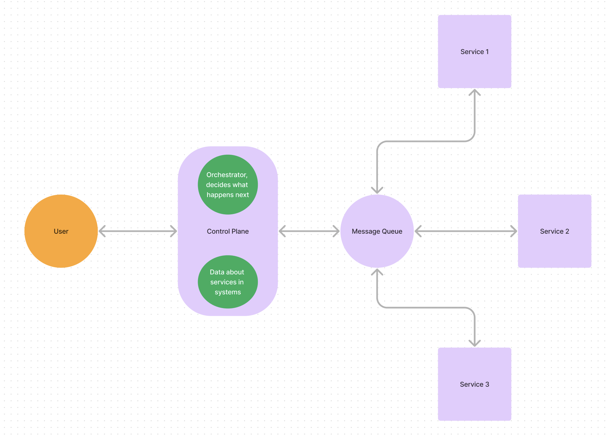
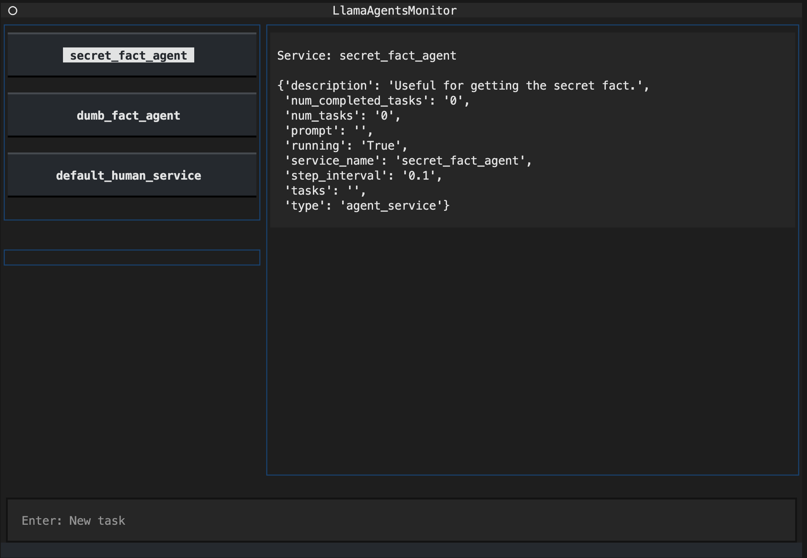

# 🦙 `llama-agents` 🤖

`llama-agents` is an async-first framework for building, iterating, and productionizing multi-agent systems, including multi-agent communication, distributed tool execution, human-in-the-loop, and more!

In `llama-agents`, each agent is seen as a `service`, endlessly processing incoming tasks. Each agent pulls and publishes messages from a `message queue`.

At the top of a `llama-agents` system is the `control plane`. The control plane keeps track of ongoing tasks, which services are in the network, and also decides which service should handle the next step of a task using an `orchestrator`.

The overall system layout is pictured below.



## Installation

`llama-agents` can be installed with pip, and relies mainly on `llama-index-core`:

```bash
pip install llama-agents
```

## Getting Started

The quickest way to get started is with a an existing agent (or agents) and wrapping into launcher.

The example below shows a trivial example with two agents from `llama-index`.

First, lets setup some agents and initial components for our `llama-agents` system:

```python
from llama_agents import (
    AgentService,
    AgentOrchestrator,
    ControlPlaneServer,
    SimpleMessageQueue,
)

from llama_index.core.agent import FunctionCallingAgentWorker
from llama_index.core.tools import FunctionTool
from llama_index.llms.openai import OpenAI


# create an agent
def get_the_secret_fact() -> str:
    """Returns the secret fact."""
    return "The secret fact is: A baby llama is called a 'Cria'."


tool = FunctionTool.from_defaults(fn=get_the_secret_fact)

worker1 = FunctionCallingAgentWorker.from_tools([tool], llm=OpenAI())
worker2 = FunctionCallingAgentWorker.from_tools([], llm=OpenAI())
agent1 = worker1.as_agent()
agent2 = worker2.as_agent()

# create our multi-agent framework components
message_queue = SimpleMessageQueue(port=8000)
control_plane = ControlPlaneServer(
    message_queue=message_queue,
    orchestrator=AgentOrchestrator(llm=OpenAI()),
    port=8001,
)
agent_server_1 = AgentService(
    agent=agent1,
    message_queue=message_queue,
    description="Useful for getting the secret fact.",
    service_name="secret_fact_agent",
    port=8002,
)
agent_server_2 = AgentService(
    agent=agent2,
    message_queue=message_queue,
    description="Useful for getting random dumb facts.",
    service_name="dumb_fact_agent",
    port=8003,
)
```

### Local / Notebook Flow

Next, when working in a notebook or for faster iteration, we can launch our `llama-agents` system in a single-run setting, where one message is propagated through the network and returned.

```python
from llama_agents import LocalLauncher

# launch it
launcher = LocalLauncher(
    [agent_server_1, agent_server_2],
    control_plane,
    message_queue,
)
result = launcher.launch_single("What is the secret fact?")

print(f"Result: {result}")
```

As with any agentic system, its important to consider how reliable the LLM is that you are using. In general, APIs that support function calling (OpenAI, Anthropic, Mistral, etc.) are the most reliable.

### Server Flow

Once you are happy with your system, we can launch all our services as independent processes, allowing for higher throughput and scalability.

By default, all task results are published to a specific "human" queue, so we also define a consumer to handle this result as it comes in. (In the future, this final queue will be configurable!)

To test this, you can use the server launcher in a script:

```python
from llama_agents import ServerLauncher, CallableMessageConsumer


# Additional human consumer
def handle_result(message) -> None:
    print(f"Got result:", message.data)


human_consumer = CallableMessageConsumer(
    handler=handle_result, message_type="human"
)

# Define Launcher
launcher = ServerLauncher(
    [agent_server_1, agent_server_2],
    control_plane,
    message_queue,
    additional_consumers=[human_consumer],
)

# Launch it!
launcher.launch_servers()
```

Now, since everything is a server, you need API requests to interact with it. The easiest way is to use our client and the control plane URL:

```python
from llama_agents import LlamaAgentsClient, AsyncLlamaAgentsClient

client = LlamaAgentsClient("<control plane URL>")  # i.e. http://127.0.0.1:8001
task_id = client.create_task("What is the secret fact?")
# <Wait a few seconds>
# returns TaskResult or None if not finished
result = client.get_task_result(task_id)
```

Rather than using a client or raw `curl` requests, you can also use a built-in CLI tool to monitor and interact with your services.

In another terminal, you can run:

```bash
llama-agents monitor --control-plane-url http://127.0.0.1:8000
```



## Examples

You can find a host of examples in our examples folder:

- [Agentic RAG + Tool Service](https://github.com/run-llama/llama-agents/blob/main/examples/agentic_rag_toolservice.ipynb)
- [Agentic Orchestrator w/ Local Launcher](https://github.com/run-llama/llama-agents/blob/main/examples/agentic_local_single.py)
- [Agentic Orchestrator w/ Server Launcher](https://github.com/run-llama/llama-agents/blob/main/examples/agentic_server.py)
- [Agentic Orchestrator w/ Human in the Loop](https://github.com/run-llama/llama-agents/blob/main/examples/agentic_human_local_single.py)
- [Agentic Orchestrator w/ Tool Service](https://github.com/run-llama/llama-agents/blob/main/examples/agentic_toolservice_local_single.py)
- [Pipeline Orchestrator w/ Local Launcher](https://github.com/run-llama/llama-agents/blob/main/examples/pipeline_local_single.py)
- [Pipeline Orchestrator w/ Human in the Loop](https://github.com/run-llama/llama-agents/blob/main/examples/pipeline_human_local_single.py)
- [Pipeline Orchestrator w/ Agent Server As Tool](https://github.com/run-llama/llama-agents/blob/main/examples/pipeline_agent_service_tool_local_single.py)
- [Pipeline Orchestrator w/ Query Rewrite RAG](https://github.com/run-llama/llama-agents/blob/main/examples/query_rewrite_rag.ipynb)

## Components of a `llama-agents` System

In `llama-agents`, there are several key components that make up the overall system

- `message queue` -- the message queue acts as a queue for all services and the `control plane`. It has methods for publishing methods to named queues, and delegates messages to consumers.
- `control plane` -- the control plane is a the central gateway to the `llama-agents` system. It keeps track of current tasks, as well as the services that are registered to the system. It also holds the `orchestrator`.
- `orchestrator` -- The module handles incoming tasks and decides what service to send it to, as well as how to handle results from services. An orchestrator can be agentic (with an LLM making decisions), explicit (with a query pipeline defining a flow), a mix of both, or something completely custom.
- `services` -- Services are where the actual work happens. A services accepts some incoming task and context, processes it, and publishes a result
  - A `tool service` is a special service used to off-load the compution of agent tools. Agents can instead be equipped with a meta-tool that calls the tool service.

## Low-Level API in `llama-agents`

So far, you've seen how to define components and how to launch them. However in most production use-cases, you will need to launch services manually, as well as define your own consumers!

So, here is a quick guide on exactly that!

### Launching

First, you will want to launch everything. This can be done in a single script, or you can launch things with multiple scripts per service, or on different machines, or even in docker images.

In this example, we will assume launching from a single script.

```python
import asyncio

# launch the message queue
queue_task = asyncio.create_task(message_queue.launch_server())

# wait for the message queue to be ready
await asyncio.sleep(1)

# launch the control plane
control_plane_task = asyncio.create_task(self.control_plane.launch_server())

# wait for the control plane to be ready
await asyncio.sleep(1)

# register the control plane as a consumer
await self.message_queue.client.register_consumer(
    self.control_plane.as_consumer(remote=True)
)

# register the services
control_plane_url = (
    f"http://{self.control_plane.host}:{self.control_plane.port}"
)
service_tasks = []
for service in self.services:
    # first launch the service
    service_tasks.append(asyncio.create_task(service.launch_server()))

    # register the service to the message queue
    await service.register_to_message_queue()

    # register the service to the control plane
    await service.register_to_control_plane(control_plane_url)
```

With that done, you may want to define a consumer for the results of tasks.

By default, the results of tasks get published to a `human` message queue.

```python
from llama_agents import (
    CallableMessageConsumer,
    RemoteMessageConsumer,
    QueueMessage,
)


def handle_result(message: QueueMessage) -> None:
    print(message.data)


human_consumer = CallableMessageConsumer(
    handler=handle_result, message_type="human"
)

message_queue.register_consumer(human_consumer)

# or, you can send the message to any URL
# human_consumer = RemoteMessageConsumer(url="some destination url")
# message_queue.register_consumer(human_consumer)
```

Or, if you don't want to define a consumer, you can just use the `monitor` to observe your system results

```bash
llama-agents monitor --control-plane-url http://127.0.0.1:8000
```
