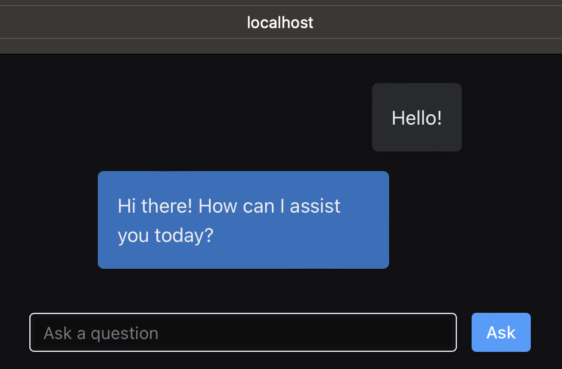

# Python Fullstack Example

This example demonstrates a fullstack application using LlamaDeploy to create and manage a deployment consisting of
two workflows: a RAG (Retrieval-Augmented Generation) and an Agentic workflow.

## Overview

The deployment consists of two main workflows:

1. RAG Workflow: A basic retrieval-augmented generation system.
2. Agentic Workflow: An advanced workflow that incorporates the RAG system and adds agentic capabilities.

These workflows are deployed as separate services using LlamaDeploy, allowing for flexible and scalable deployment
options.

Then, a simple frontend is built using [reflex](https://reflex.dev/) to allow you to chat with the agentic workflow.

## Project Structure

Let's walk through the important files and folders:

- `python_fullstack.yaml`: The deployment definition. It instructs LlamaDeploy about which services to deploy and
  how to retrieve the source code for them.
- `frontend/`: A simple frontend built using [reflex](https://reflex.dev/) to allow you to chat with the deployed agentic workflow.
  - `frontend/frontend/frontend.py`: The `reflex` app definition. Builds a basic chat UI.
  - `frontend/frontend/state.py`: The state management for the frontend. This is where we actually connect to the
    LlamaDeploy API server to chat with the workflows.
  - `frontend/frontend/style.py`: The style management for the frontend. This is where we define the style of the chat UI.
- `workflows/`: The workflows themselves, including the RAG workflow and the agentic workflow.
  - `workflows/agent_workflow.py`: The agentic workflow that uses the RAG workflow.
  - `workflows/rag_workflow.py`: The RAG workflow. This includes indexing with a qdrant vector store, retrieval, reranking with RankGPT, and a response synthesis step.

The application relies on different components:

- A Redis instance used by the LlamaDeploy message queue
- A Qdrant instance used by the RAG workflow
- A LlamaDeploy API server instance managing the deployment
- The Reflex application serving the UI at http://localhost:3000

A `docker-compose.yml` file is provided to orchestrate all these components, see the "Usage" section below.

### Dependencies

The project relies on several key libraries:

- llama-deploy: For service deployment and management.
- llama-index: For building and running the workflows.
- Various llama-index extensions for specific functionalities (e.g., `RankGPT`, `QdrantVectorStore`).

## Usage

1. Ensure you have [docker installed](https://docs.docker.com/engine/install/) and running.
2. Export your OpenAI key in your terminal (i.e. `export OPENAI_API_KEY="..."`)
3. Run `docker compose up` from this example root path (`examples/python_fullstack`) to start the frontend and backend services.
4. Open your browser and navigate to `http://localhost:3000` to access the chat interface and chat with the deployed RAG workflow and agentic workflow.

## Network topology

- LlamaDeploy API server:

  - Port: 8000
  - RAG Workflow Service:
    - Port: assigned by apiserver
    - Service Name: "rag_workflow"
  - Agentic Workflow Service:
    - Port: assigned by apiserver
    - Service Name: "agentic_workflow"

- Frontend:

  - Port: 3000

- Qdrant:

  - Port: 6333

- Redis:
  - Port: 6379

## Extensibility

This example serves as a foundation for building more complex applications. You can extend the workflows, add new services, or integrate with other components of your system as needed.
